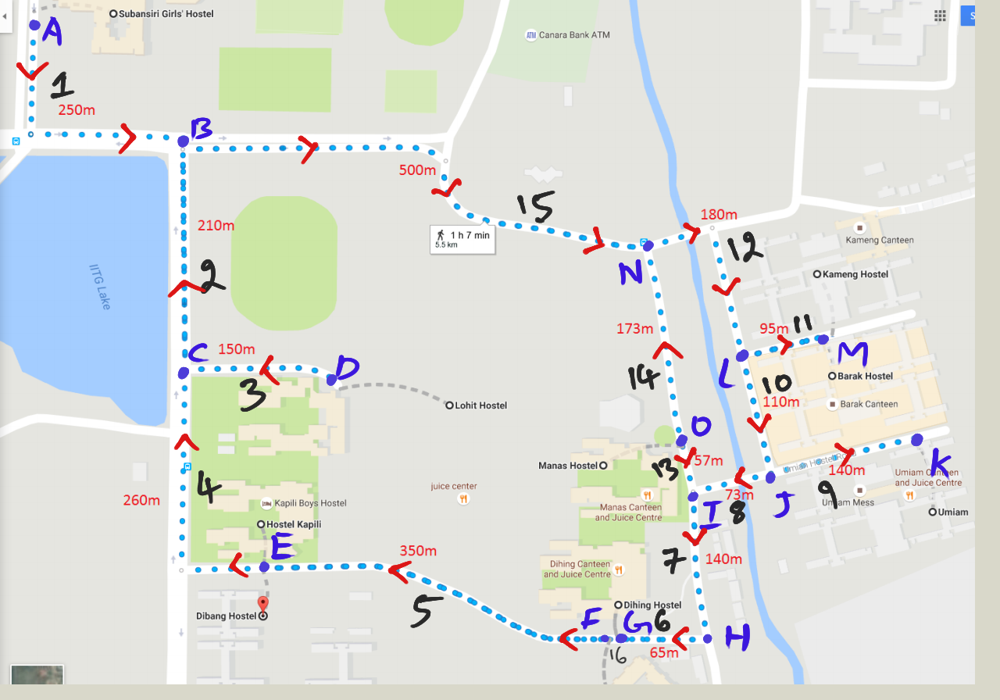
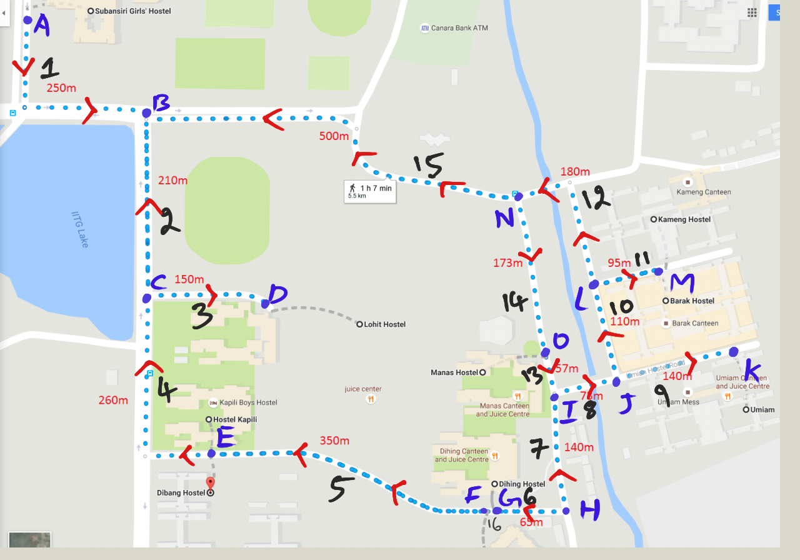

#Assignment 1

The lists of roll numbers of students registered in 4 different courses mentioned in the assignment are present in cs201.txt, cs341.txt, cs431.txt and ma101.txt.

The program reads the roll numbers from these files.

It generates using the pseudo-random function random_rollno_generator(L) that takes L, the list of all the course information files as input.

The documentation of the function is present in the code itself.

##Output


"from " "cs341.txt"

140101004  140101006  140101013  140101015  140101019  140101022  140101024  140101028  140101031  140101033  140101037  140101039  140101040  140101042  140101046  140101048  140101051  140101055  140101057  140101060  140101064  140101066  140101073  140101075  140101079  140101082  140101084  140101088  140123002  140123006  140123008  140123011  140123015  140123017  140123020  140123024  140123026  140123033  140123035  140123039  140123042  140123048  140123051  


"from " "cs201.txt" 

150101003  150101005  150101009  150101012  150101014  150101018  150101021  150101023  150101027  150101029  150101030  150101032  150101036  150101038  150101041  150101045  150101047  150101050  150101054  150101056  150101063  150101065  150101069  150101072  150101074  150101078  150101081  150101083  150101087  

"from " "cs431.txt" 

10010128  130101001  130101005  130101007  130101010  130101014  130101016  130101023  130101025  130101029  130101032  130101034  130101038  130101041  130101043  130101047  130101049  130101050  130101052  130101056  130101058  130101061  130101065  130101067  130101070  130101076  130101083  130101085  130101089  


"from " "ma101.txt" 

140101033  140103064  150103054  150104006  150104053  150107027  150121010  160101002  160101004  160101008  160101011  160101013  160101017  160101019  160101020  160101022  160101026  160101028  160101031  160101035  160101037  160101040  160101044  160101046  160101053  160101055  160101059  160101062  160101064  160101068  160101071  160101073  160101077  160101080  160102001  160102003  160102007  160102009  160102010  160102012  160102016  160102018  160102021  160102025  160102027  160102030  160102034  160102036  160102043  160102045  160102049  160102052  160102054  160102058  160102061  160102063  160102067  160102070  160102072  160103002  160103006  160103008  160103011  160103015  160103017  160103020  160103024  160103026  160103033  160103035  160103039  160103042  160103044  160103048  160103051  160103053  160103057  160103060  160103062  160103066  160103071  160103075  160104001  160104005  160104007  160104010  160104014  160104016  160104023  160104025  160104029  160104032  160104034  160104038  160104041  160104043  160104047  160104050  160104052  160104056  160104061  160104065  160104070  160104074  160106003  160106005  160106009  160106012  160106014  160106018  160106021  160106023  160106027  160106030  160106032  160106036  160106041  160106045  160106050  160106054  160107002  160107004  160107008  160107011  160107013  160107017  160107020  160107022  160107026  160107031  160107035  160107040  160107044  160107053  160107059  160107062  160107068  160108001  160108003  160108007  160108010  160108012  160108016  160108021  160108025  160108030  160108034  160121002  160121006  160121008  160121011  160121015  160121017  160121020  160121024  160121026  160121033  160121035  160121039  160121042  160121044  160122001  160122005  160122007  160122010  160122016  160122023  160122025  160122029  160122032  160122034  160122038  160122041  160122043  160123004  160123006  160123013  160123015  160123019  160123022  160123024  160123028  160123031  160123033  160123037  160123040  160123042 


#Assignment 2

Here we implement the simplified approximation of simpson's rule.

h/3 * (sigma from 1 to n/2) [ f(x_2j-2) + 4*f(x_2j-1) + f(x_2j)  ]

The documentation for the implemention of this formula is simple and is done in the code itself.

##output
```
design 1 4x^2: 
Simpsons = 75.29395, Trapezoid Method = 74.6672
design 2 4e^x: 
Simpsons = 189.99529, Trapezoid Method = 188.84265
design 3 4x^4 - 4x^3:
Simpsons = 554.8175, Trapezoid Method = 553.62506
```


#Assignment 3

We have labelled diagrams in three traffic flow scenarios in the diagrams uploaded in this url

https://drive.google.com/drive/folders/0B4wMJCt4kEmbVi1FWnFnLWQyeDA

This link contain three images
1. Scenario 1 
2. scenario 2 
3. scenario 3 


Let us discuss the reachability if the student wishes to go from  one hostel to other for three pairs of hostels

1. Brahmaputra to Dihing
2. Dihing to subansiri
3. Manas to Umiam

Now we examine the ouput of the program in each of these scenarios for each of these three pairs of hostels

			
#output


|            | Brahmaputra to dihing | Dihing to Subansiri | Manas to Umiam |
|------------|-----------------------|---------------------|----------------|
| scenario 1 | 1888                  | No path             | 603            |
| scenario 2 | No path               | No path             | 270            |
| scenario 3 | 2                     | 1318                | 270            |


